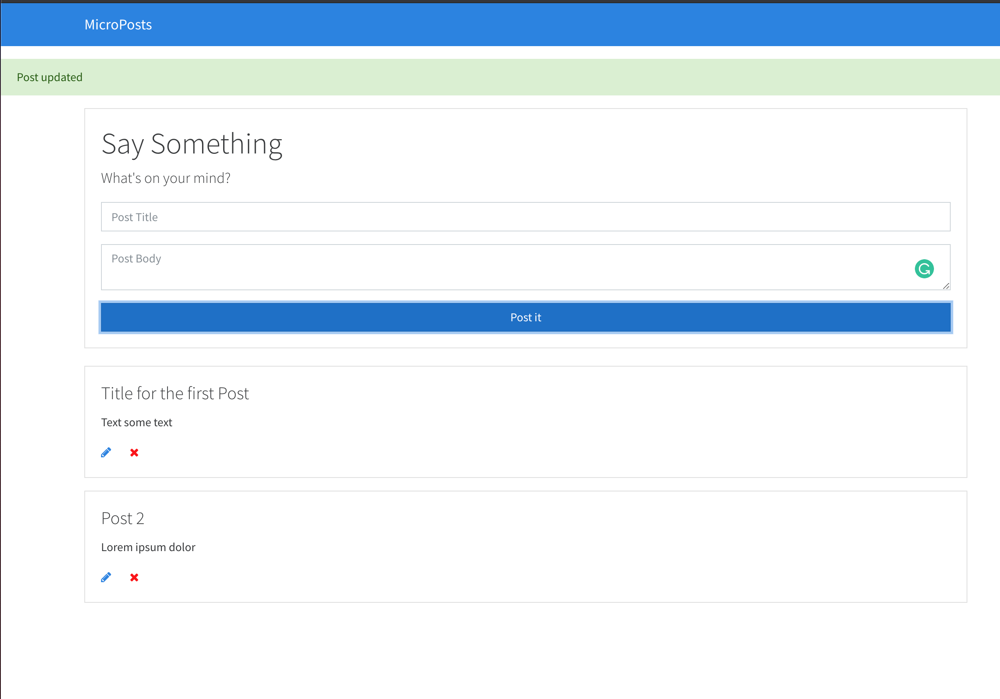

# MicroPosts APP



MicroPosts project is a small blog (full-stack app) made using the CRUD paradigm with the help of HTML, plain JS, bootstrap CSS, JSON API.

### Version

1.0.0

## Usage

### Installation

Install the dependencies

```sh
$ npm install
```

### Serve

To serve in the browser - Runs webpack-dev-server

```sh
$ npm start
```

### Run Server

To synchronize JSON REST API server

```sh
$ npm run json:server
```

### Build

Compile and build

```sh
$ npm run build
```
